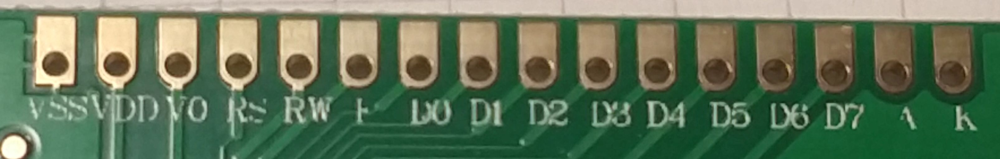
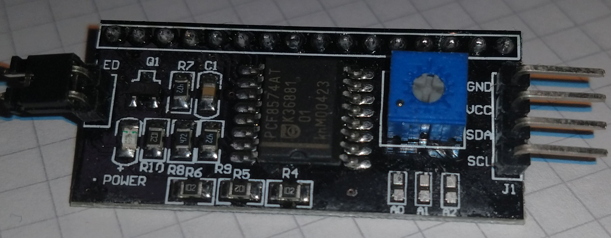
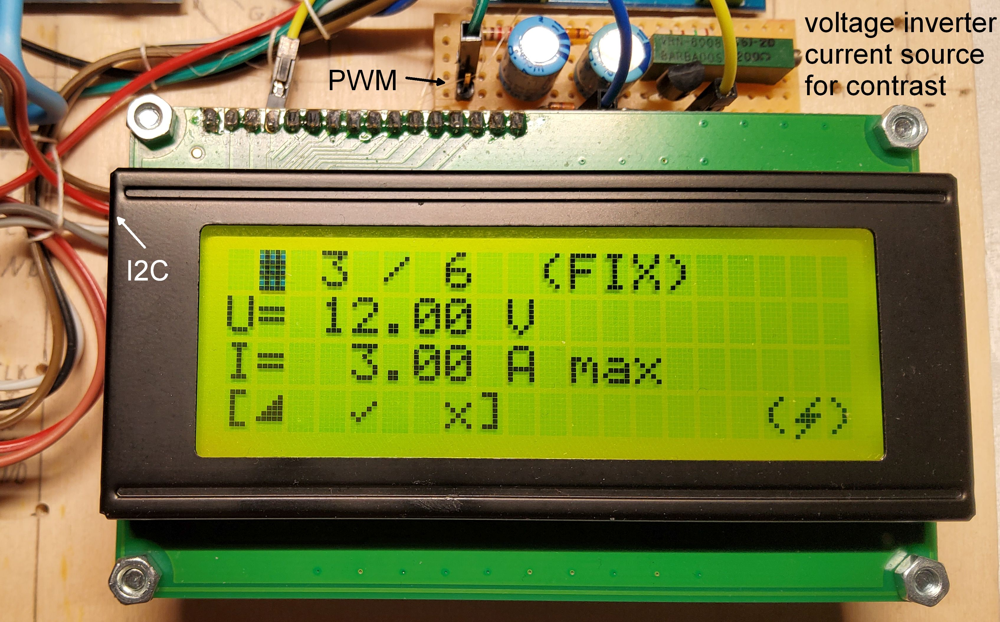
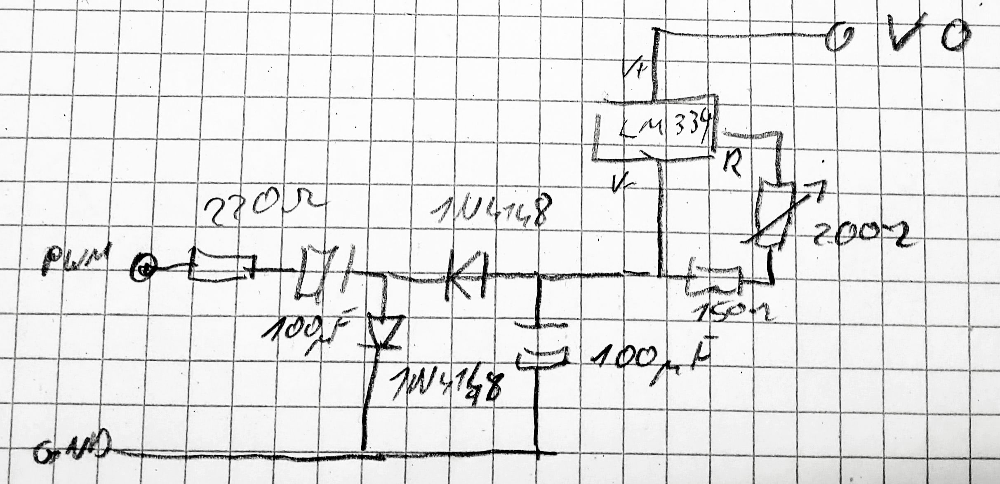

# LCD44780

#### Table of contents

- [description](#description)
- [HW considerations](#HW-considerations)
    - [HD44780 pin count](#HD44780-pin-count)
        - [HD44780 speed](#HD44780-speed)
        - [i2c port expander](#i2c-port-expander)
        - [i2c transfer speed](#i2c-transfer-speed)
	    - [adjustable brightness](#adjustable-brightness)
	    - [operation at 3.3 V](#operation-at-3.3-V)
		- [solution](#solution)
- [SW structure](#SW-structure)
    - [lcd class](#lcd-class)
        - [initialisation](#initialisation)
        - [displaying text](#displaying-text)
        - [displaying numbers](#displaying-numbers)
        - [user defined characters](#user-defined-characters)
        - [display control](#display-control)
        - [progress bar](#progress-bar)
    - [lcdio class](#lcdio-class)
    - [cat4004 class](#cat4004-class)


## description
Driver for HD44780 based LCDs controlled via I2C for Arduino based platforms

Oh no not another HD44780 driver  
Yes it ist, but ...  

I know there are tons of HD44780 implementations out there, there are ready to run and easy to use but none of them suited my requirements.

## HW considerations

I needed:  
- minimal pin count
- fast (or at least non blocking)
- adjustable brigtness
- operation at 3.3 V 

### HD44780 pin count
HD44780 based LCD (ranging from singel line 16 character to 4 line 20 character per line displays) 
need 11 pins for data transfer. 3 Control pins (RegisterSelect, ReadWriteSelect and Enable) and 8 Data pins.  
This is not minimal pin count. Luckyly the chip can operate in 4 bit mode, this reduces the pin count to 7.
Even 7 is not minimal. Therefore I used one of the PCF8574 I2C port expanders. This reduces the pin count to 2.  
This is neglegtible because the I2C pins are shared among all other devices.  

### HD44780 speed
This comes at a cost: speed.
The HD44780 is not very fast.A command takes ~40 µs (for an 8 bit acces and up to 1.6 ms for the home function). 
The minimum Enable cycle time is 1µs. One should check the Busys flag after each command.  
Using parallel I/O would reuire several wait states when usen externel bus HW. Even a quite slow Arduino Uno with 
62.5 ns instruction time is fast compared to this.  
Using 4 bit acces one will need two cycles per byte.  

### i2c port expander
there are I2c LCD display adaptors out there which can be connected directly to the display featuring an additional 
backlight jumper and and a contrast pot. Some of them even feature a backlight switch on bit 3. But more on that later.  
These adaptors use an PCF8574 or PCA8574 I2C port expander originally introduced by Philips (now [NXP](https://www.nxp.com/) ).
The only difference is speed. The PCF is rated for 100 kHz and the PCA ist rated for 400 kHz. Although I don't recommend to
to use chips beyond spec one could try to force the PCF version to 400 kHz.   
***Attention: Both chips are available with index "A". Index A has different I2C Adress range. Standard is 0x20-0x27, 
A is 0x38-0x3F***  
 

#### i2c transfer speed
Assuming the Chip is operated at 400 kHz a singele byte write would take two transfers, the addressbyte and the databyte.
This comes at the cost of 1 Startcondition, 2x 8 bits, 2x Ack bit, 1 Stop condition. (Same for reading one byte). 
So writing 8 bits to the port expander takes 20 cykles @ 400 kHz = 50 µs. To transfer 4 bits to HD44780 
one need to set RegisterSelect ReadWrite and data lines. Then the enable line needs to be asserted for et least 450ns.
to assert and deassert the enable line 2 additional byte transfers are required. so a 4 bit write cycle casts an additional
18 cycles. 9 bits are transfered whithin 22.5 µs. In total we need 95 µs for an 4 bit transfer.
For the next 4 bits another 3 x 9 bits are required so a single a bit transfer might take up to 162.5 µs. This is even slower
as direct parallel transfer but ...   
There is no upper time limit. we can start a part of the transfer sequence and then do something else. Next time we continue
were we left. So even when using busy waiting for a full transfer this will block only ~170 µs.
When using one of the standard LCD libraries the operation will block the system until it is accomplished.

#### adjustable brightness
If we define adjustable as on and off we are finished otherwise a controllable current source ist needed. This is done by the
CAT4004. Although the LCD class is designed to utilize the CAT4004 this is not mandatory. If no CAT4004 pin is defined the SW
makes use of bit 3  of the I2C adaptor.

#### operation at 3.3 V 
The I2C to LCD adaptor board provides a potentiometer for contrast voltage. The contrast voltage is referenced to VCC and 
should be between 3 V and 11 V below VCC. The datasheet tests have been performed at 4 V. On my samples the voltage had to 
be set to 3.7 V at room temperature. 
And here is the elephant:
Even when connecting VO to GND the LCD voltage is only 3.3 V where 3.7 V was needed.  

The solution: I had to modify the I2C adaptor for external contrast voltage. In a first try I used the Villard / 
Greinacher Circuit to create -VCC form a PWM pin. When not using a potentiometer to set the contrast voltage but using a 
constant current source it is even possible to operate at different VCC between 3.3 V and 5 V.  
The trick is to use the internal voltage divder of the display. You need to create a voltage referenced to VCC. The resistors
of the display are connected to VCC. So driving a constant current through these resistors will create a constant voltage 
across them independet of the the actual VCC. The only downside is you might need a negative Voltage to have enough margin
for the currrent source.

When using a CAT4004 the LED brigtness is stable too. But: there are different types of LCD Backlight with different voltage
ratings. Although the HD44780 is suitable for 3.3 V operation the backlight might not.

#### solution
This is the bit assignement of most I2c to LCD adaptors:  
|bit|     signal      |
|---|-----------------|
| 0 | register select |
| 1 | read /write     |
| 2 | enable          |
| 3 | backlight enable|
| 4 | D4              |
| 5 | D5              | 
| 6 | D6              |
| 7 | D7              |

##### pinout of HD44780 compatible LCD


##### typical I2C to LCD adaptor:
  
to use this adaptor with an external contrast voltage the potentiometer needs to be removed. The wiper pin
could be used to connect the contrast voltage.

##### HD44780 compatible 16x4 display with PCF8574 and external contrast
  

##### schematic


## SW structure
the sw structure consist of three levels  
the fist level is the ***lcd module***. It provides the high level functionality such as writing text, 
setting cursor and atttributes, defining custom characters operating the backlight generating a progress bar.  

the second is the ***lcdio module***. This the i2c transfer state machine it splits any command in a maximum of 
4 consecutive i2c writes/reads. The state machine proceeds whenever lcd::process is called.  

the third module is the ***cat4004 module*** this is only used when a cat4004 is used for brightness control.  

### lcd class
This module a buffer and a buffer flag for characters and mode flags.  
Whenever an operation is requested, it is checked if the desired value is different from th bufferd value.
If ther is no difference the is nothing to do otherwise the new value ist stored and the dirty flag is set.
On each call to ***lcd::process*** one flag is checked and a transfer is initiated if necessary. The next flag
will be checked when transfer in ***lcdio*** is finished.

The module features these functions:  
```
	lcd(uint8_t adresse=0xff, uint8_t inverterPin=0xff, uint8_t brightnessPin=0xff, unsigned char Index=' ');
	void init(uint8_t cols, uint8_t rows);	
	void process(void);
	
	void putChar(const uint8_t x, const uint8_t y, const char c); 
	void putChar(const uint8_t x, const uint8_t y, const char * c); 
	void putChar(const uint8_t x, const uint8_t y, const __FlashStringHelper * c);
	void putChar_P(const uint8_t x, const uint8_t y, const char * c);

	void putSigned(uint8_t x, uint8_t y, uint8_t size, int16_t val);
	void putUnsigned(uint8_t x, uint8_t y, uint8_t size, uint16_t val);
	void putFixed(uint8_t x, uint8_t y, uint8_t size, uint8_t decimals, uint8_t base, uint16_t val);
	void putFixed(uint8_t x, uint8_t y, uint8_t size, uint8_t decimals, uint8_t base, int16_t val);
	void putHex(uint8_t x, uint8_t y, uint8_t size, uint16_t val);

	void DefineChar(uint8_t char_pos, const uint8_t * char_data);
	void DefineChar(uint8_t char_pos, const __FlashStringHelper * char_data);
	void DefineChar_P(uint8_t char_pos, const uint8_t * char_data);
	
	void Home();
	void Clear();
	void CursorPos(uint8_t x, uint8_t y);
	void CursorOn(bool bOn);
	void BacklightOn(bool bOn);
	void CursorBlink(bool bBlink);
	void DisplayOn(bool bOn);
	void SetContrast(uint8_t Contrast);
	void SetBrightness(uint8_t Brightness);
	uint8_t GetBrightness(void);

	void ProgressBarInit(	uint8_t x, uint8_t y, 	// Position of progress bar
							uint8_t length,			// length of progressbar (1-20)
							uint8_t progress);		// initial state of Progress Bar
	void ProgressSet(uint8_t progress);				// draw new Bar, 0-100
```  

#### initialization
The constructor need s a few parameters
1. the I2C address of the PCF8574  
If omitted or 0xFF is specified the auto detection is used.  
Use this function with care. The program scans 0x20 ... 0x27 and 0x38 ... 0x3F. If there are 
other I2C devices in this range the program will most likely crash
1. the inverter pin  
the IO pin which is connected to the Greinacher circuit. If not used omit or set to 0xFF
1. the brightness pin
This is the pin connected to the CAT4004, omit or set to 0xFF if not used.
1. CAT4004 index
defaults to no index if omitted. not reqired if brightness pin is set to 0xFF.

the first function to be called is the init function to tell the SW the dimensions of the display  

now process needs to be called regulary.

There is no need to check the status of th initialisaiton because any acces to the 
display will be bufferd and postponed untile the display is ready.

#### displaying text
There are several overloads of the putChar funciton which allows to output a singele
character or a string at the specified position

#### displaying numbers
1. displaying integers  
to display an integer number you need to specify the position and the space do 
be reserved for the nimber. The number will be reight aligned.
2. displaying fractionals  
due to the fact the there is now real floating point support one could use dcimals in IQ notation.  
eg. there is a number 12.345 which should be dispalyed as " 12.3". therfore the size is 5, the 
decimals are 1 and the base is 3.  
Note: all numbers are truncated and not rounded.

#### user defined characters 
The HD44780 allows up to 8 user defined characters at address 0 - 7.
The display uses 5x8 dot characters. Data has to be set line by line using only the lower 5 bits.  
see datasheet for details.

#### display control
- Home  
sets the cursor in the upper left corner
- Clear
clears the display and sets the cursor in the upper left corner
- CursorPos  
sets the cursor to the desired position
- CursorOn  
enables the crusor as defined (underline or blink)
- BacklightOn  
enables or disables the backlight  
if no CAT4004 is used this is just on / off therwise the last brightness setting is used
- CursorBlink  
sets the cursor to blink or no blink (underline)
- DisplayOn  
enables or disables the display
- SetContrast  
dummy fucntion not used  
when implementig this function keep in mind that a seperate actuator is needed. When 
the contrast voltage is set incorrectly it is not possible to read any messages! 
- SetBrightness  
set the brightness level for CAT4004. Ignore when not used
- GetBrightness  
last brightnes level

#### progress bar
The SW provides a horizontal progress bar. To use the progress bar one need to define 
the position and size of the progressbar in characters as well as the initial 
progress (0-100) using the ***ProgressBarInit function***.  
To modifiy the progress bar use the ***ProgressSet function***.  
The Progress bar occupies the user defined characte #0. Any user characer at #0 
will be lost.
To disable the progress bar either set progress to 0 or overwrite the space defined 
for the progress bar.

### lcdio class
this is the I2C to HD44780 interface. there is no need to call any function directly.
This class ensures that any call to lcd::process will only use 4 bytes of I2C transfer.  
If the function is still pending it will proceed on the next call to lcd::process.

### cat4004 class
see [CAT4004](https://github.com/Ueberspannung/Cat4004)
